## [WIP] Implmentation of the Deep Unsupervised Saliency Detection: A Multiple Noisy Labeling Perspective
Requirements
---
1. pytorch 1.0
2. python 3.6
3. numpy
Dataset
---
1. MSRA-B

Results
---

# Table of Contents

1.  [Training on Small Dataset(10 Images)](#orgbc7573f)
2.  [Training on Large Dataset(1500 Images Training, 500 Images Validataion, 500 Images Test)](#org3fc0cdd)

# Training on Small Dataset(10 Images)

Experiment Performed for overfitting, checking if the model works, tested for
all models, Only reporting for the full(Training Noise module)

# Training on Large Dataset(1500 Images Training, 500 Images Validataion, 500 Images Test)

The most important part here is the scheduler, since we keep on training with
the same leanring rate without,
Image size is taken to be 256, Number of Epochs is 20, Early Stopping on
validation loss, paitence of 5 epochs

1.  Exp-1 Using Adam Optimizer

    <table border="2" cellspacing="0" cellpadding="6" rules="groups" frame="hsides">

    <colgroup>
    <col  class="org-left" />

    <col  class="org-left" />

    <col  class="org-right" />

    <col  class="org-right" />

    <col  class="org-left" />

    <col  class="org-left" />

    <col  class="org-left" />

    <col  class="org-left" />

    <col  class="org-right" />

    <col  class="org-right" />

    <col  class="org-right" />

    <col  class="org-right" />

    <col  class="org-right" />

    <col  class="org-right" />

    <col  class="org-right" />

    <col  class="org-right" />

    <col  class="org-right" />
    </colgroup>
    <thead>
    <tr>
    <th scope="col" class="org-left">Exp Name</th>
    <th scope="col" class="org-left">Optimizer</th>
    <th scope="col" class="org-right">Batch Size</th>
    <th scope="col" class="org-right">LR</th>
    <th scope="col" class="org-left">Betas</th>
    <th scope="col" class="org-left">Momentum</th>
    <th scope="col" class="org-left">Scheduler</th>
    <th scope="col" class="org-left">Notes</th>
    <th scope="col" class="org-right">Decay Factor</th>
    <th scope="col" class="org-right">Paitence</th>
    <th scope="col" class="org-right">THRESHOLD</th>
    <th scope="col" class="org-right">MINLR</th>
    <th scope="col" class="org-right">COOLDOWN</th>
    <th scope="col" class="org-right">Recall-Test</th>
    <th scope="col" class="org-right">Precision-Test</th>
    <th scope="col" class="org-right">F1-Test</th>
    <th scope="col" class="org-right">MAE-TEST</th>
    </tr>
    </thead>

    <tbody>
    <tr>
    <td class="org-left">Real</td>
    <td class="org-left">Adam</td>
    <td class="org-right">16</td>
    <td class="org-right">3e-4</td>
    <td class="org-left">(0.9, 0.99)</td>
    <td class="org-left">x</td>
    <td class="org-left">ReduceLROnPlateu</td>
    <td class="org-left">Label is the ground truth</td>
    <td class="org-right">0.9</td>
    <td class="org-right">1</td>
    <td class="org-right">1e-4</td>
    <td class="org-right">1e-16</td>
    <td class="org-right">1</td>
    <td class="org-right">0.5023</td>
    <td class="org-right">0.9622</td>
    <td class="org-right">0.66</td>
    <td class="org-right">0.035</td>
    </tr>

    <tr>
    <td class="org-left">Noise</td>
    <td class="org-left">Adam</td>
    <td class="org-right">8</td>
    <td class="org-right">3e-4</td>
    <td class="org-left">(0.9, 0.99)</td>
    <td class="org-left">x</td>
    <td class="org-left">ReduceLROnPlateu</td>
    <td class="org-left">Use all Noise labesl</td>
    <td class="org-right">0.9</td>
    <td class="org-right">1</td>
    <td class="org-right">1e-4</td>
    <td class="org-right">1e-16</td>
    <td class="org-right">1</td>
    <td class="org-right">0.793</td>
    <td class="org-right">0.946</td>
    <td class="org-right">0.862</td>
    <td class="org-right">0.028</td>
    </tr>

    <tr>
    <td class="org-left">Avg</td>
    <td class="org-left">Adam</td>
    <td class="org-right">16</td>
    <td class="org-right">3e-4</td>
    <td class="org-left">(0.9, 0.99)</td>
    <td class="org-left">x</td>
    <td class="org-left">ReduceLROnPlateu</td>
    <td class="org-left">Use Avg of Noise Labels</td>
    <td class="org-right">0.9</td>
    <td class="org-right">1</td>
    <td class="org-right">1e-4</td>
    <td class="org-right">1e-16</td>
    <td class="org-right">1</td>
    <td class="org-right">0.802</td>
    <td class="org-right">0.907</td>
    <td class="org-right">0.851</td>
    <td class="org-right">0.041</td>
    </tr>

    <tr>
    <td class="org-left">Full</td>
    <td class="org-left">Adam</td>
    <td class="org-right">4</td>
    <td class="org-right">3e-4</td>
    <td class="org-left">(0.9, 0.99)</td>
    <td class="org-left">x</td>
    <td class="org-left">ReduceLROnPlateu</td>
    <td class="org-left">Full Training</td>
    <td class="org-right">0.9</td>
    <td class="org-right">1</td>
    <td class="org-right">1e-4</td>
    <td class="org-right">1e-16</td>
    <td class="org-right">1</td>
    <td class="org-right">0.841</td>
    <td class="org-right">0.857</td>
    <td class="org-right">0.848</td>
    <td class="org-right">0.036</td>
    </tr>
    </tbody>
    </table>

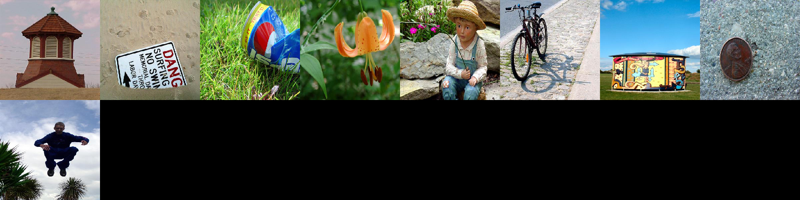

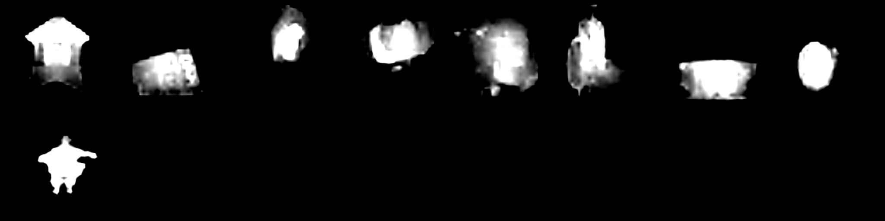

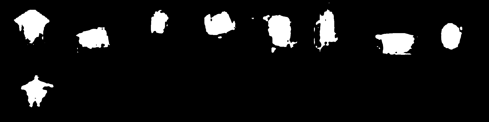

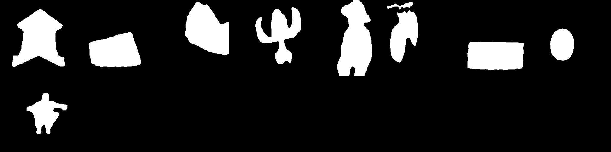

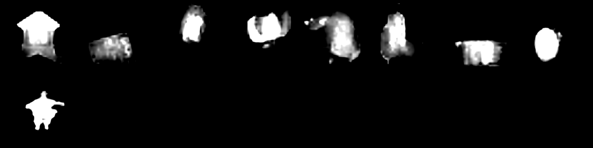

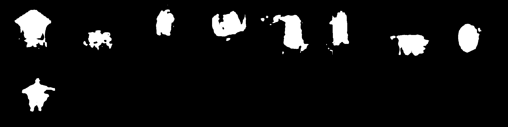

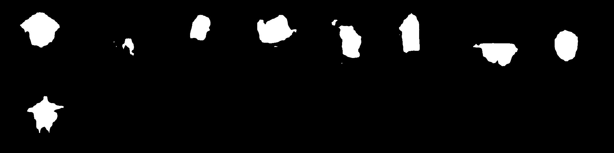

1.  Exp-2 Using SGD Optimizer

    <table border="2" cellspacing="0" cellpadding="6" rules="groups" frame="hsides">

    <colgroup>
    <col  class="org-left" />

    <col  class="org-left" />

    <col  class="org-right" />

    <col  class="org-right" />

    <col  class="org-left" />

    <col  class="org-right" />

    <col  class="org-left" />

    <col  class="org-left" />

    <col  class="org-right" />

    <col  class="org-right" />

    <col  class="org-right" />

    <col  class="org-right" />

    <col  class="org-right" />

    <col  class="org-right" />

    <col  class="org-right" />

    <col  class="org-right" />

    <col  class="org-right" />
    </colgroup>
    <thead>
    <tr>
    <th scope="col" class="org-left">Exp Name</th>
    <th scope="col" class="org-left">Optimizer</th>
    <th scope="col" class="org-right">Batch Size</th>
    <th scope="col" class="org-right">LR</th>
    <th scope="col" class="org-left">Betas</th>
    <th scope="col" class="org-right">Momentum</th>
    <th scope="col" class="org-left">Scheduler</th>
    <th scope="col" class="org-left">Notes</th>
    <th scope="col" class="org-right">Decay Factor</th>
    <th scope="col" class="org-right">Paitence</th>
    <th scope="col" class="org-right">THRESHOLD</th>
    <th scope="col" class="org-right">MINLR</th>
    <th scope="col" class="org-right">COOLDOWN</th>
    <th scope="col" class="org-right">Recall-Test</th>
    <th scope="col" class="org-right">Precision-Test</th>
    <th scope="col" class="org-right">F1-Test</th>
    <th scope="col" class="org-right">MAE-TEST</th>
    </tr>
    </thead>

    <tbody>
    <tr>
    <td class="org-left">Real</td>
    <td class="org-left">SGD</td>
    <td class="org-right">16</td>
    <td class="org-right">1e-3</td>
    <td class="org-left">x</td>
    <td class="org-right">0.9</td>
    <td class="org-left">ReduceLROnPlateu</td>
    <td class="org-left">Label is the ground truth</td>
    <td class="org-right">0.9</td>
    <td class="org-right">1</td>
    <td class="org-right">1e-4</td>
    <td class="org-right">1e-16</td>
    <td class="org-right">1</td>
    <td class="org-right">0.865</td>
    <td class="org-right">0.907</td>
    <td class="org-right">0.885</td>
    <td class="org-right">0.032</td>
    </tr>

    <tr>
    <td class="org-left">Noise</td>
    <td class="org-left">SGD</td>
    <td class="org-right">8</td>
    <td class="org-right">1e-3</td>
    <td class="org-left">x</td>
    <td class="org-right">0.9</td>
    <td class="org-left">ReduceLROnPlateu</td>
    <td class="org-left">Use all Noise labesl</td>
    <td class="org-right">0.9</td>
    <td class="org-right">1</td>
    <td class="org-right">1e-4</td>
    <td class="org-right">1e-16</td>
    <td class="org-right">1</td>
    <td class="org-right">0.620</td>
    <td class="org-right">0.820</td>
    <td class="org-right">0.706</td>
    <td class="org-right">0.044</td>
    </tr>

    <tr>
    <td class="org-left">Avg</td>
    <td class="org-left">SGD</td>
    <td class="org-right">16</td>
    <td class="org-right">1e-3</td>
    <td class="org-left">x</td>
    <td class="org-right">0.9</td>
    <td class="org-left">ReduceLROnPlateu</td>
    <td class="org-left">Use Avg of Noise Labels</td>
    <td class="org-right">0.9</td>
    <td class="org-right">1</td>
    <td class="org-right">1e-4</td>
    <td class="org-right">1e-16</td>
    <td class="org-right">1</td>
    <td class="org-right">0.934</td>
    <td class="org-right">0.639</td>
    <td class="org-right">0.758</td>
    <td class="org-right">0.058</td>
    </tr>

    <tr>
    <td class="org-left">Full</td>
    <td class="org-left">SGD</td>
    <td class="org-right">4</td>
    <td class="org-right">1e-3</td>
    <td class="org-left">x</td>
    <td class="org-right">0.9</td>
    <td class="org-left">ReduceLROnPlateu</td>
    <td class="org-left">Full Training</td>
    <td class="org-right">0.9</td>
    <td class="org-right">1</td>
    <td class="org-right">1e-4</td>
    <td class="org-right">1e-16</td>
    <td class="org-right">1</td>
    <td class="org-right">0.825</td>
    <td class="org-right">0.795</td>
    <td class="org-right">0.809</td>
    <td class="org-right">0.027</td>
    </tr>
    </tbody>
    </table>

Average Exp Sample Maps
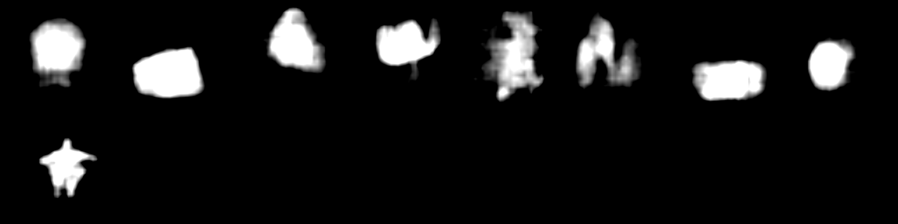

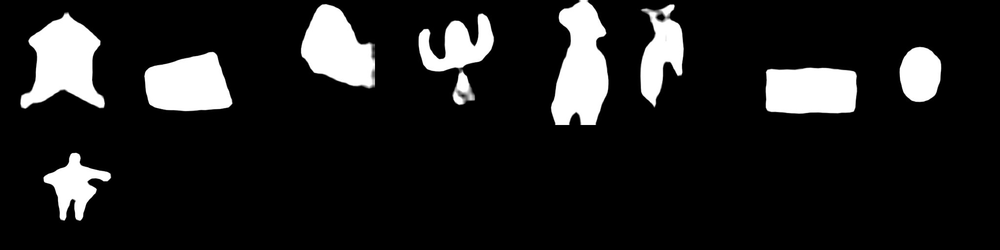

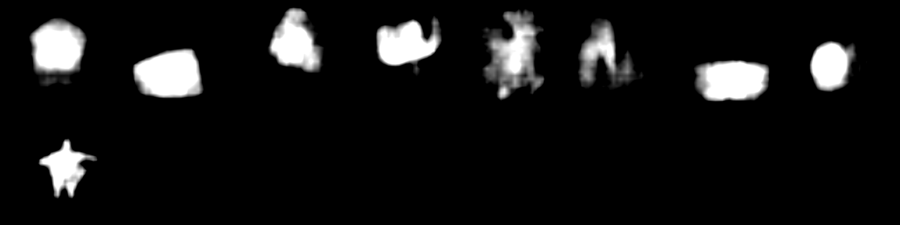

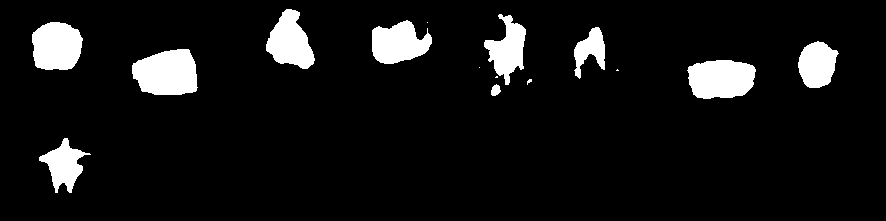

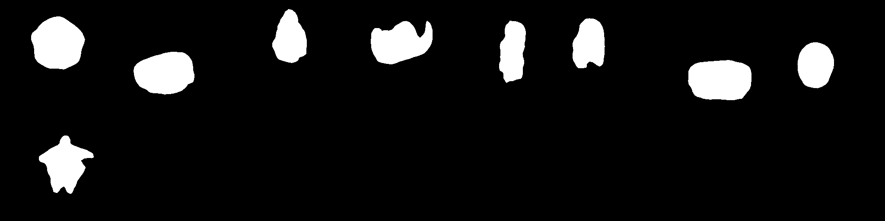

